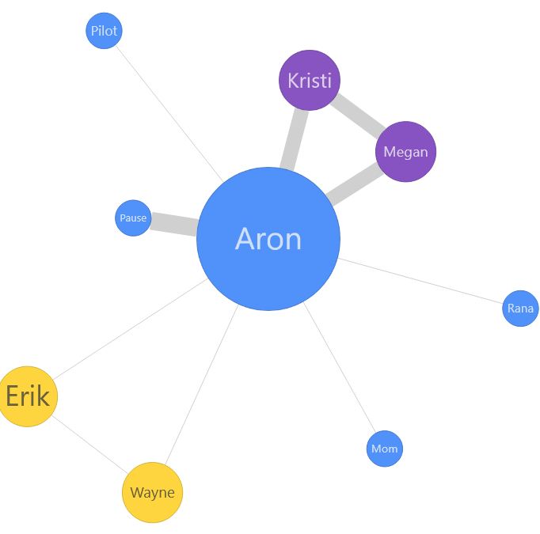

# Data

Our dataset is the `moviesgalaxies` dataset: a collection of graphs, each representing a movie. [^1]

Each movie has a node for each named character, and has a weight for every other character equal to the number scenes they share. For example, in the movie *127 Hours*

- Aron and Kristi are in 4 scenes together, so they get a (relatively) highly weighted edge
- Aron and Rana are only in 1 scene together, so they get a low-weighted edge
- Erik doesn't share a scene with Pilot, so they have no edge



[^1] The dataset can be downloaded from Netzschleuder, with a very user-friendly version at [https://moviegalaxies.com/](https://moviegalaxies.com/)


```{r}
# label: Data Setup
dir.create("data", showWarnings = FALSE)
base_url <- "https://raw.githubusercontent.com/tzheng7679/STAT-4194-Project/main/data/"

# Specific sample of 20 movies
movies_sample <- read_tsv(I("id\ttitle\n488\tThe Last Samurai\n682\tReservoir Dogs\n130\tBlack Rain\n134\tBlade Runner\n671\tThe Reader\n843\tTRON\n495\tLeviathan\n41\tAlien: Resurrection\n816\tThirteen Days\n227\tThe Crying Game\n511\tLord of Illusions\n791\tSugar & Spice\n487\tThe Last of the Mohicans\n217\tCrank\n116\tBeing Human\n471\tThe King's Speech\n189\tChasing Sleep\n244\tDeath to Smoochy\n320\tFrench Kiss\n214\tCoraline"))
```

# The Goal

We want to see what types of network analysis most effectively capture movie network structure, and what types of patterns we can observe in relationships between movie characters. We use models

- Erdos-Renyi (a baseline)
- Chung-Lu
- SBM
- Spectral
- AME

# ER Model



# Chung-Lu Model



# Spectral Model



# AME



# Conclusion

- Simpler models like the Chung-Lu and Erdos-Renyi models struggle with higher order strucutre, as is typical in networks.
    - Movies have a complex structure of character appearances
- Spectral clustering is quite performant and adapts to different cast structures
    - It picks up structures for both ensemble and centralized movies
    - Movies often vary; some are protagonist-driven, while others can feature a wide variety of appearances
- AME modelling can struggle, but provides insight into positioning
    - Characters can be represented with a latent position; characters in the same subplot can share a similar position
    - More expensive modelling not necessary for movies; their structure is fairly well represented by spectral models